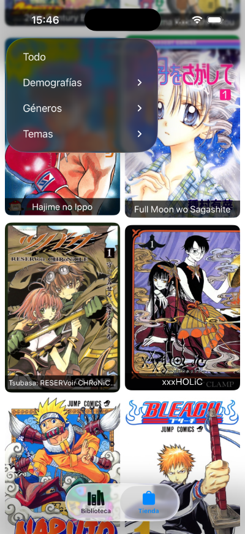
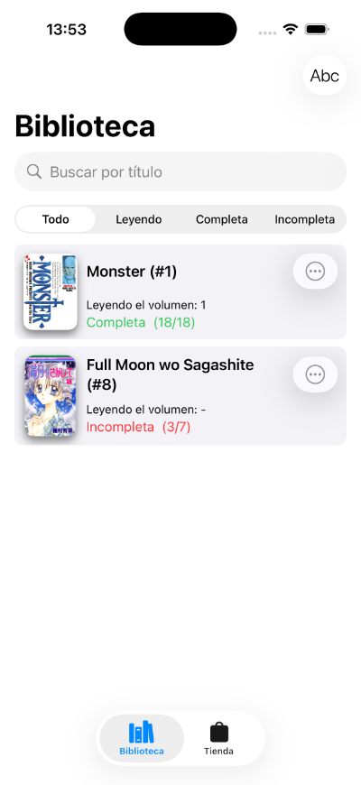
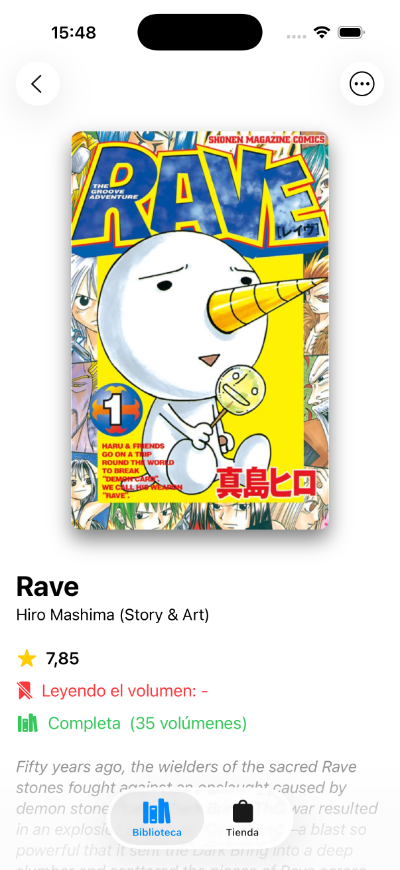
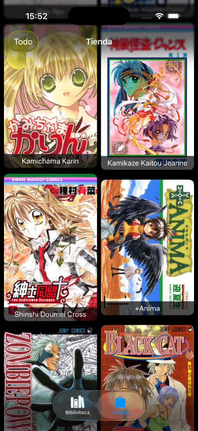
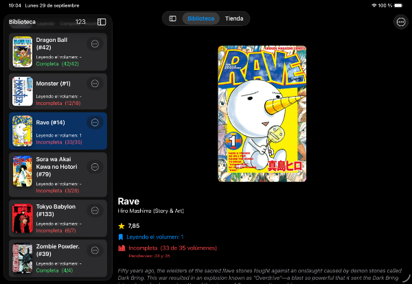

# 📚 My Manga

My Manga es una aplicación iOS para buscar y gestionar tus colecciones de Manga, desarrollada en **Swift 6** con **SwiftUI** y **SwiftData**.

## 📸 Screenshots

| Store View | Library View | Detail View |
|:----------:|:------------:|:-----------:|
|  |  |  |
| Vista principal del Store | Biblioteca personal | Información detallada |

### 🌓 iPad, Modo Oscuro
| Store (Dark) | Library (Dark) |
|:------------:|:--------------:|
|  |  |

## ✨ Características

- 🔍 Visualiza y busca Mangas en la Tienda y en tu biblioteca personal
- 🚀 Carga dinámica de datos remotos a medida que se hace scroll
- ⚠️ Manejo de errores de red con mensajes claros y opción de reintento
- 📚 Gestión de biblioteca personal de Mangas
- 💾 Persistencia local de la biblioteca con SwiftData
- 🔖 Filtrado por estado: Todo, Leyendo, Completa, Incompleta
- 📝 Alternar entre ordenación alfabética y por número de Manga
- 📋 Vistas de información detallada para cada Manga
- 📱 Compatible con iPhone y iPad, adaptándose a diferentes tamaños de pantalla
- ✨ Transiciones elegantes al filtrar y ordenar, usando SwiftUI y matchedGeometryEffect

## 🚀 Requisitos

- iOS 18.0 o superior
- Xcode 16 o superior
- Swift 6

## 🛠️ Instalación

1. Clona este repositorio:
    ```sh
    git clone https://github.com/jbistue/My-Manga.git
    ```
2. Abre `My Manga.xcodeproj` en Xcode
3. Compila y ejecuta la app en tu simulador o equipo (iPhone o iPad)
4. Explora la tienda, añade mangas a tu biblioteca y prueba los filtros y búsquedas

## 🔧 Tecnologías Utilizadas

- **Swift 6** + **SwiftUI 6**
- **SwiftData** para persistencia local
- **Concurrencia estricta** con async/await para llamadas a la API
- **Previews dinámicas** con SwiftUI
- **Estrategia de fetch por lotes** (batchSize) para optimizar la carga de datos

## 🏗️ Estructura del Proyecto

```
My Manga/
├── View/
│   ├── LibraryView.swift      # Vista principal de biblioteca con filtros y búsqueda
│   └── StoreView.swift        # Vista principal del Store para ver y descargar colecciones
├── Model/
│   ├── Manga.swift.           # Modelo de Manga según formato de la API
│   └── LibraryItemDB.swift    # Modelo de datos para elementos Manga de la biblioteca
└── ViewModel/
    └── MangaViewModel.swift   # Maneja la lógica de negocio y carga de datos
```

## 📝 Notas de Desarrollo

- **StoreView**: Carga mangas desde la API y gestiona la paginación
- **LibraryView**: Muestra la biblioteca y resalta el manga seleccionado en iPad
- **ViewModel**: Maneja la lógica de negocio y la carga de datos de forma asincrónica
- **Sistema de errores**: NetworkError personalizado para feedback al usuario

## 🔍 Previews y Testing

- 🎨 Incluye previews con datos de muestra para desarrollo sin conexión a la API
- 🌓 Compatible con modo oscuro y light mode

## 🤝 Contribuciones

Las Pull Requests son bienvenidas. Para cambios importantes, por favor abre un issue primero para discutir lo que te gustaría cambiar.

## 📄 Licencia

Este proyecto está bajo la Licencia MIT - ver el archivo [LICENSE](LICENSE) para más detalles.
